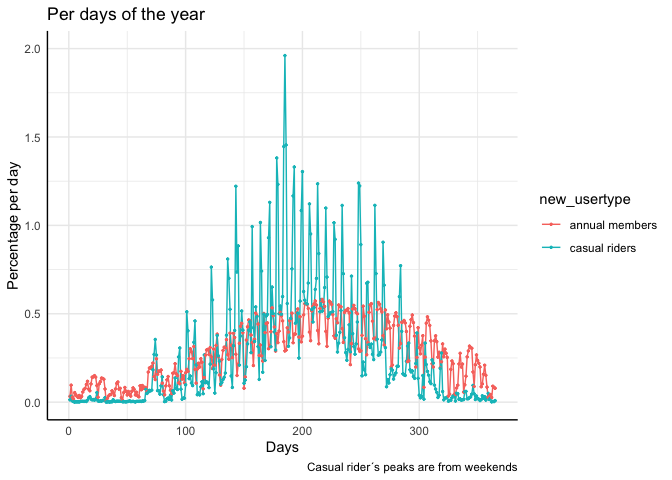

# Cyclistic-Case-Study
Case Study project from Google Data Analysis course

Cyclistic Case Study
================
Juan Cordova
3/3/2022

Case Study project

This project was carried out as a data analysis exercise with a real
dataset, The data and idea of the project were part of the **Google Data
Analysis course** , which is used to obtain the **Data Analysis
Certificate** from Google. The analysis, visualizations, conclusions and
recommendations were done by me.

The data is provided by Bikeshare (Divvy), a company who operates the
City of Chicago’s bike-sharing service, (you can see the license to use
the data ***here***).

For this exercise, the name Cyclistic will be used as the fictitious
company that provides the data.

## Case Study: Cyclistic Bike-Share year 2015

### Scenario

Being a junior data analyst working in the marketing team at Cyclistic,
a share-bike company in the city of Chicago, you now have to develop the
following project. The director of marketing believes that the future of
the company depends on maximizing the number of annual members.
Therefore, it is necessary to know how casual riders and annual members
use the Cyclistic service, so that their differences are known in order
to carry out a marketing strategy campaign that seeks to convert casual
riders into annual members.

The team leader asks you to answer the following question:

-   How do annual members and casual riders use Cyclistic bikes
    differently?

### Business Task

**Problem:** *How do annual members and casual riders use Cyclistic
bikes differently?*

What is intended?

-   Learn how casual cyclists and annual subscribers use the bike-share
    service

How would it be achieved?

-   By Analyzing the data provided by Cyclistics

What is the analysis looking for?

-   Find discoveries between the differences between the two types of
    users of the system, in order to make data-driven decisions

What will be generated?

-   A summary of the analysis

-   Supporting visualizations and key findings

-   Main recommendations based on the analysis done that will respond to
    the question posed.

### Data sources used

All the files referring to the year 2015 provided by the company
Cyclistics were downloaded.

All these data were organized in a folder in chronological order

Two types of tables were found:

-   A table with the list of the stations names with their Ids that were
    on the system in the year 2015

-   Several tables with the information of all the trips made in the
    year 2015

Using the **rbin()** function, all the tables of the year 2015 were
joined, to have a single table in a single file.

### Documentation of data cleaning

*Check each column, that what it should be is fulfilled, checking the
data type and if there are errors correct them*

The columns have names that are understood, they will not be changed

Checking the columns data type:

-   Columns with date and time are changed to mdy_hm format (columns
    “starttime” and “stoptime)

Reviewing the station columns, both “from_station_name” and
“to_station_name” it was found a greater number of stations than in the
stations file, it was seen that there are stations with different names
but with the same Id, therefore, it was decided to change the names that
were not in the station file for the one that was in the file and had
the ID repeated. Most cases were the same station but with name
variations.

-   The mutate() function was used and the number and name stations are
    now equal to those in the list

The values of the bithyear column were reviewed and a small number of
people were found saying that they were born more than one hundred years
ago, the data was found to be unrealistic, so by seeing this, it was
decided to only take as values the years of birth from 1915 to 2015.

-   Minor values were removed from the list with the replace_with_na()
    function, these were not more than 50 cases so their removal did not
    affect any subsequent measurement.

The usertype was changed to only two: *“Customer”* and *“Dependent”* to
**“Casual Riders”** and *“Subscriber”* to **“Annual Member”**, the
mutate() function was used to rewrite the “usertype” column with
“news_usertype” with the two types of users

A column was created with the age of the users who provided their year
of birth

All other columns and their data types are correct

### Summary of the data analysis, with visualizations

Analysis of the Cyclistic bikes-share’s dataset of the year 2015

#### 1 Load of packages and file upload

-   Packages used

``` r
library(dplyr)
library(readr)
library(skimr)
library(hablar)
library(tidyverse)
library(ggplot2)
library(scales)
library(lubridate)
```

-   Upload of the file “year_2015_f2.csv” (the file is in the folders)

``` r
year_2015_f2 <- read_csv("full_2015_v2.csv")
```

    ## Rows: 3183439 Columns: 14
    ## ── Column specification ────────────────────────────────────────────────────────
    ## Delimiter: ","
    ## chr (7): starttime, stoptime, from_station_name, to_station_name, usertype, ...
    ## dbl (7): trip_id, bikeid, tripduration, from_station_id, to_station_id, birt...
    ## 
    ## ℹ Use `spec()` to retrieve the full column specification for this data.
    ## ℹ Specify the column types or set `show_col_types = FALSE` to quiet this message.

#### 2 Data review

-   See table columns and firts rows

<!-- -->

    ##   trip_id       starttime      stoptime bikeid tripduration from_station_id
    ## 1 4738454 3/31/2015 23:58 4/1/2015 0:03   1095          299             117
    ## 2 4738450 3/31/2015 23:59 4/1/2015 0:15    537          940              43
    ## 3 4738449 3/31/2015 23:59 4/1/2015 0:11   2350          751             162
    ## 4 4738448 3/31/2015 23:59 4/1/2015 0:19    938         1240              51
    ## 5 4738445 3/31/2015 23:54 4/1/2015 0:15    379         1292             134
    ##              from_station_name to_station_id               to_station_name
    ## 1     Wilton Ave & Belmont Ave           300          Broadway & Barry Ave
    ## 2 Michigan Ave & Washington St            85         Michigan Ave & Oak St
    ## 3   Damen Ave & Wellington Ave            67 Sheffield Ave & Fullerton Ave
    ## 4       Clark St & Randolph St            59     Wabash Ave & Roosevelt Rd
    ## 5     Peoria St & Jackson Blvd           216  California Ave & Division St
    ##     usertype gender birthyear   new_usertype age
    ## 1 Subscriber   Male      1994 annual members  21
    ## 2   Customer   <NA>        NA  casual riders  NA
    ## 3 Subscriber   Male      1992 annual members  23
    ## 4   Customer   <NA>        NA  casual riders  NA
    ## 5 Subscriber   Male      1976 annual members  39

-   There are 3,183,439 trips, each trip has its type of user, also each
    trip is taken as made by a unique and different user, since there is
    no information that relates the users with the trips made (for
    license reasons)

#### 3 Distribution of users in the system in 2015

-   Graphic

<!-- -->

#### 4 Duration of trips

-   Added a column with the conversion from seconds to minutes

``` r
year_2015_f2 <- year_2015_f2 %>% 
  mutate(tripduration_min = tripduration / 60)
```

-   The average of each type of user is shown

<!-- -->

#### 5 Gender of users

-   Of 930 026 casual riders only 161 provided gender, so they will not
    be taken into account to avoid bias

<!-- -->

-   Gender distribution of annual members

<!-- -->

#### 6 Age of users

-   Of 930 026 casual riders only 171 provided age, so they will not be
    taken into account to avoid bias

<!-- -->

-   Age distribution of annual members

<!-- -->

#### 7 Analysis of departure stations

-   Top 10 departure stations of annual members

<!-- -->

-   Top 10 departure stations of casual riders

<!-- -->

-   Departure stations distribution of both user types

<!-- -->

#### 8 Analysis of arrival stations

-   Top 10 arrival stations of annual members

<!-- -->

-   Top 10 arrival stations of casual riders

<!-- -->

-   Arrival stations distribution of both user types

<!-- -->

#### 9 Top routes (complete trips)

-   Added a column with the routes (complete trips) using the unite()
    function to unite the “from_station_name” column with the
    “to_station_name” column

``` r
year_2015_f2 <- year_2015_f2 %>% 
  unite("trip_rute", from_station_name, to_station_name, sep = " to ",
        remove = FALSE)
```

-   Top 10 routes (complete trips) of annual members

<!-- -->

-   Top 10 routes (complete trips) of casual riders

<!-- -->

-   Distribution of routes (complete trips) of both user types

<!-- -->

#### 10 Analysis by time: By month

-   Percentage of trips per month

<!-- -->

#### 11 Analysis by time: By day of the week

-   Percentage of trips by day of the week

<!-- -->
Casual riders use the system mainly on weekends, concentrating 47.9% of
their trips between Saturday and Sunday, \* Percentage of trips by day
of the week of each month

<!-- -->

#### 12 Analysis by time: By time of day

-   Percentage of trips per hour of the day

<!-- -->

-   Percentage of trips by hour of the day of each month

<!-- -->

#### 13 Analysis by time: By day of the year

-   Percentage of trips per day of the year

<!-- -->

### Findings

-   Casual riders double in average travel time, but they are only a
    quarter of all trips made

-   Users who provide age (annual members) have a range that oscillates
    mainly between 25 and 35 years (with a concentration of 53.5%)

-   Casual riders concentrate 27.9% in their trips on a top 10 departure
    stations (start stations), compared to the annual riders who only
    concentrate 10.9%. Also, In the arrival stations, the top 10 of the
    casual riders concentrate 30.3% of the trips compared to the annual
    riders who only concentrate 10.8%. This confirms that casual riders
    concentrate on certain stations while annuals use the system more
    widely, without concentrating on specific stations.

-   Casual riders concentrate 5.98% of their trips on a top 10 rutes
    (complete trips), compared to the annual members who only
    concentrate 0.76%. This shows that casual riders tend to have
    specific routes

-   Casual riders clearly use the system in the summer, with 57.7% of
    their trips made between August and September.

-   Casual riders use the system mainly on weekends, concentrating 47.9%
    of their trips between Saturday and Sunday, while an opposite
    behavior is shown in the annual members who use the system during
    the week, having 80.2% of their trips between Monday to Friday with
    a distribution of 16% per day in that interval.

-   Annual members use the system at work start and end times, casual
    riders mainly use the system in the afternoon

### Insights

To answer the question that was raised: How do annual members and casual
riders use Cyclistic bikes differently?

-   There is a clear greater use of the service in the summer months,
    but this is extremely noticeable in casual members who make more
    than half of their trips in the months of June to August.

-   The casual riders are concentrated in specific stations, either
    departure or arrival, concentrating almost 30% in 10 departure
    stations and 30% in 10 arrival stations, A comparison of the annual
    members that have an almost homogeneous distribution throughout the
    service stations both in arrival and departure. This same phenomenon
    happens in routes (complete trips).

-   It is clearly marked that casual riders use the service mainly on
    weekends, Saturday and Sunday, contrary to annual members who use
    the system on weekdays.In the same way, there is a clear difference
    in the hours of the day in which the service is used, the annual
    members use the service mainly in the hours of departure and arrival
    of work, while the casual riders use them in the afternoon between
    12 and 6 p.m.

-   This shows the clearest difference, the annual riders use the system
    as a transportation system, mainly to get to and from work, while
    the casual riders use the system as a leisure activity, using the
    service on weekends and in summer

### Recommendations

For the marketing campaign that seeks to convert casual riders to annual
members, you should focus on users who use the system as a recreational
activity, looking for an offer in this regard.

In addition, it can clearly be indicated that the marketing campaign
should focus on a schedule from 12:00 p.m. to 6:00 p.m., on Saturdays
and Sundays, but above all, have a strong presence in the summer months
of June, July, and August.
